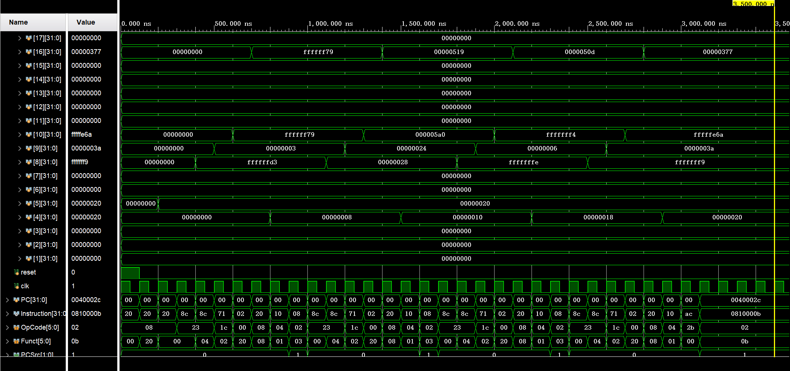
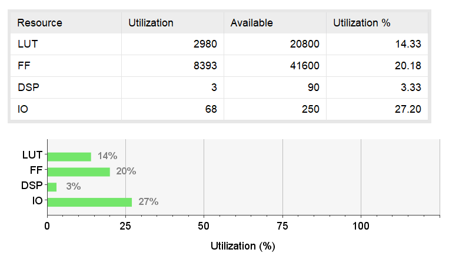
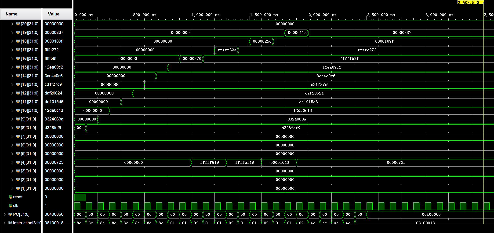
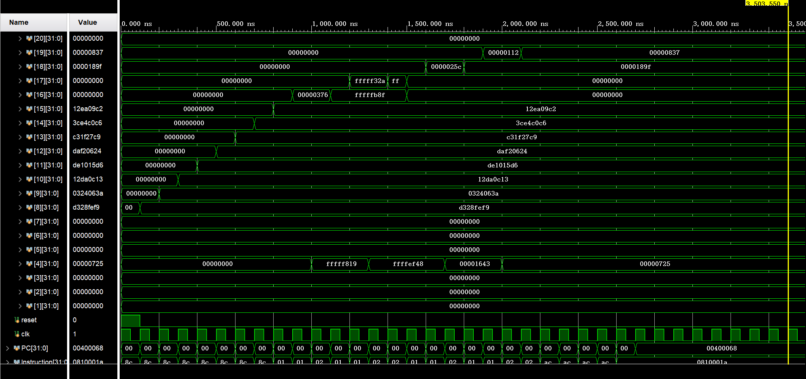
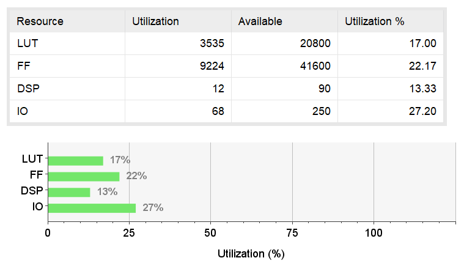

# The Fundamentals of Digital Logic and Processors Project: Processor: MIPS Single-Cycle Processor

## MIPS single-cycle processor

### a)

**According to the functions of each control signal, fill in the following true table of the MIPS instruction subset and control signals (fill in 0, 1, 2, x, etc.), and implement the Verilog code in the control module (`Control.v`) under the single-cycle folder.**

|       | PCSrc[1:0] | Branch | RegWrite | RegDst[1:0] | MemRead | MemWrite | MemtoReg[1:0] | ALUSrc1 | ALUSrc2 | ExtOp | LuOp |
| ----: | ---------: | -----: | -------: | ----------: | ------: | -------: | ------------: | ------: | ------: | ----: | ---: |
|    lw |          0 |      0 |        1 |           0 |       1 |        0 |             1 |       0 |       1 |     1 |    0 |
|    sw |          0 |      0 |        0 |           x |       0 |        1 |             x |       0 |       1 |     1 |    0 |
|   lui |          0 |      0 |        1 |           0 |       0 |        0 |             0 |       0 |       1 |     x |    1 |
|   add |          0 |      0 |        1 |           1 |       0 |        0 |             0 |       0 |       0 |     x |    x |
|  addu |          0 |      0 |        1 |           1 |       0 |        0 |             0 |       0 |       0 |     x |    x |
|   sub |          0 |      0 |        1 |           1 |       0 |        0 |             0 |       0 |       0 |     x |    x |
|  subu |          0 |      0 |        1 |           1 |       0 |        0 |             0 |       0 |       0 |     x |    x |
|  addi |          0 |      0 |        1 |           0 |       0 |        0 |             0 |       0 |       1 |     1 |    0 |
| addiu |          0 |      0 |        1 |           0 |       0 |        0 |             0 |       0 |       1 |     1 |    0 |
|   mul |          0 |      0 |        1 |           1 |       0 |        0 |             0 |       0 |       0 |     x |    x |
|   and |          0 |      0 |        1 |           1 |       0 |        0 |             0 |       0 |       0 |     x |    x |
|    or |          0 |      0 |        1 |           1 |       0 |        0 |             0 |       0 |       0 |     x |    x |
|   xor |          0 |      0 |        1 |           1 |       0 |        0 |             0 |       0 |       0 |     x |    x |
|   nor |          0 |      0 |        1 |           1 |       0 |        0 |             0 |       0 |       0 |     x |    x |
|  andi |          0 |      0 |        1 |           0 |       0 |        0 |             0 |       0 |       1 |     0 |    0 |
|   sll |          0 |      0 |        1 |           1 |       0 |        0 |             0 |       1 |       0 |     x |    x |
|   srl |          0 |      0 |        1 |           1 |       0 |        0 |             0 |       1 |       0 |     x |    x |
|   sra |          0 |      0 |        1 |           1 |       0 |        0 |             0 |       1 |       0 |     x |    x |
|   slt |          0 |      0 |        1 |           1 |       0 |        0 |             0 |       0 |       0 |     x |    x |
|  sltu |          0 |      0 |        1 |           1 |       0 |        0 |             0 |       0 |       0 |     x |    x |
|  slti |          0 |      0 |        1 |           0 |       0 |        0 |             0 |       0 |       1 |     1 |    0 |
| sltiu |          0 |      0 |        1 |           0 |       0 |        0 |             0 |       0 |       1 |     1 |    0 |
|   beq |          0 |      1 |        0 |           x |       0 |        0 |             x |       0 |       0 |     1 |    0 |
|     j |          1 |      x |        0 |           x |       0 |        0 |             x |       x |       x |     x |    x |
|   jal |          1 |      x |        1 |           2 |       0 |        0 |             2 |       x |       x |     x |    x |
|    jr |          2 |      x |        0 |           x |       0 |        0 |             x |       x |       x |     x |    x |
|  jalr |          2 |      x |        1 |           2 |       0 |        0 |             2 |       x |       x |     x |    x |

We can implement the control module as follows:

```verilog
assign PCSrc = 
  (OpCode == 6'h02 || OpCode == 6'h03)? 2'b01: //j, jal
  (OpCode == 6'h00 && Funct == 6'h08)? 2'b10: //jr
  2'b00; //others
assign Branch = 
  (OpCode == 6'h04)? 1'b1: //beq
  1'b0; //others
assign RegWrite =
  (OpCode == 6'h2b || OpCode == 6'h03 || (OpCode == 6'h00 && Funct == 6'h08))? 1'b0: //sw, j, jr
  1'b1; //others
assign RegDst =
  (OpCode == 6'h03 || (OpCode == 6'h00 && Funct == 6'h09))? 2'b10: //jal, jalr
  (OpCode == 6'h23 || OpCode == 6'h0f || OpCode == 6'h08 || OpCode == 6'h09 || OpCode == 6'h0c || OpCode == 6'h0a || OpCode == 6'h0b)? 2'b00: //lw, lui, addi, addiu, andi, slti, sltiu
  2'b01; //others
assign MemRead =
  (OpCode == 6'h23)? 1'b1: //lw
  1'b0; //others
assign MemWrite =
  (OpCode == 6'h2b)? 1'b1: //sw
  1'b0; //others
assign MemtoReg =
  (OpCode == 6'h23)? 2'b01: //lw
  (OpCode == 6'h03)? 2'b10: //jal
  2'b00; //others
assign ALUSrc1 =
  ((OpCode == 6'h00 && Funct == 6'h00) || (OpCode == 6'h00 && Funct == 6'h02) || (OpCode == 6'h00 && Funct == 6'h03))? 1'b1: //sll, srl, sra
  1'b0; //others
assign ALUSrc2 =
  (OpCode == 6'h23 || OpCode == 6'h2b || OpCode == 6'h0f || OpCode == 6'h08 || OpCode == 6'h09 || OpCode == 6'h0c || OpCode == 6'h0a || OpCode == 6'h0b)? 1'b1: //lw, sw, lui, addi, addiu, andi, slti, sltiu
  1'b0; //others
assign ExtOp =
  (OpCode == 6'h0c)? 1'b0: //andi
  1'b1; //others
assign LuOp =
  (OpCode == 6'h0f)? 1'b1: //lui
  1'b0; //others
```

### b)

**Read the code in MIPS Assembly 1-1. After the program runs long enough, what are the values of the register `$v0`, `$v1`, `$a0`, `$a1`, `$a2`, `$a3`, `$t0`, `$t1`, `$t2`, and `$t3`, respectively (which are corresponding to registers 2-11)?**

```assembly
    addi    $a0,    $zero,      12123   # $a0 = 12123 = 0x00002F5B
    addiu   $a1,    $zero,      -12345  # $a1 = -12345 = 0xFFFFCFC7
    sll     $a2,    $a1,        16      # $a2 = $a1 << 16 = 0xCFC70000
    sra     $a3,    $a2,        16      # $a3 = $a2 >> 16 = 0xFFFFCFC7
    sw      $a0,    0($zero)            # Memory[0] = $a0 = 0x00002F5B
    beq     $a3,    $a1,        L1      # if $a3 == $a1, branch to L1
    lui     $a0,    22222               # Not executed

L1: 
    add     $t0,    $a2,        $a0     # $t0 = $a2 + $a0 = 0xCFC72F5B
    sra     $t1,    $t0,        8       # $t1 = $t0 >> 8 = 0xFFCFC72F
    addi    $t2,    $zero,      -12123  # $t2 = -12123 = 0xFFFFD0A5
    slt     $v0,    $a0,        $t2     # $v0 = ($a0 < $t2) = 0
    sltu    $v1,    $a0,        $t2     # $v1 = ($a0 < $t2 unsigned) = 1
    lw      $t3,    0($zero)            # $t3 = Memory[0] = 0x00002F5B

Loop:
    j       Loop                        # Infinite loop
```

The values of the registers are as follows: 

- `$v0` = 0
- `$v1` = 1
- `$a0` = `0x00002F5B` = 12123
- `$a1` = `0xFFFFCFC7` = -12345
- `$a2` = `0xCFC70000` = -809041920
- `$a3` = `0xFFFFCFC7` = -12345
- `$t0` = `0xCFC72F5B` = -809029797
- `$t1` = `0xFFCFC72F` = -3160273
- `$t2` = `0xFFFFD0A5` = -12123
- `$t3` = `0x00002F5B` = 12123

## c)

**Copy the code in `Inst-q1.txt` to the corresponding location in `InstructionMemory.v`; Copy the code in `Data-q1.txt` to the corresponding location in `DataMemory.v`. Finish the simulation based on the top module (i.e., `test_cpu.v`). Please show the simulation waveforms of the registers in b), and verify the correctness of the calculation results and the functions of the designed single-cycle processor.**


The simulation waveforms show that the values of the registers are consistent with the results in b). The program runs correctly and the values of the registers are as expected.

## d)

**Read the code in MIPS Assembly 1-2, which implements the function of: $z = \sum_{k=0}^3 x_k y_k$. After the program runs long enough, what are the values of the register `$a0`, `$a1`, and `$s0`, respectively?**

```assembly
INIT:
    addi    $a0,    $zero,  0   # $a0 = 0
    addi    $a1,    $zero,  32  # $a1 = 32
    addi    $s0,    $zero,  0   # $s0 = 0
LOOP:
    lw      $t0,    0($a0)      # $t0 = Memory[$a0]
    lw      $t1,    4($a0)      # $t1 = Memory[$a0 + 4]
    mul     $t2,    $t0,    $t1 # $t2 = $t0 * $t1
    add     $s0,    $s0,    $t2 # $s0 = $s0 + $t2
    addi    $a0,    $a0,    8   # $a0 = $a0 + 8
    beq     $a0,    $a1,    L1  # If $a0 == $a1, jump to L1
    j       LOOP                # Jump to LOOP
L1: 
    sw      $s0,    0($a1)      # Memory[$a1] = $s0
END:
    j       END                 # Infinite loop
```

The values of the registers are as follows:

- `$a0` = 32 = `0x00000020`
- `$a1` = 32 = `0x00000020`
- `$s0` = $\sum_{k=0}^3 x_k y_k$

If we use the values in `Data-q1.txt`, we have `$s0` = (-45) × 3 + 40 × 36 + (-2) × 6 + (-7) × 58 = 887 = `0x00000377`.

## e)

**Copy the code in `Inst-q1-2.txt` (corresponding to MIPS Assembly 1-2) to the corresponding location in `InstructionMemory.v`; Copy the code in `Data-q1.txt` to the corresponding location in `DataMemory.v`. Finish the simulation using ModelSim, Vivado or other simulators. The top module is `test_cpu.v`. Please show the simulation waveforms of the registers in d), and verify the correctness of the calculation results and the functions of the designed single-cycle processor.**



The simulation waveforms show that the values of the registers are consistent with the results in d). The program runs correctly and the values of the registers are as expected.

## f)

**Using the FPGA board in the experiment course, finish the synthesis and static timing analysis (STA) in Vivado. Require to use the constraint file in the attachment (i.e., `xdc_for_both.xdc`). Based on the resource utilization report and timing report in Vivado, show the maximum clock frequency and the resource utilization of CPU. Please include the corresponding screenshots of the resource utilization report and timing report in Vivado.**

- `Inst-q1-1.txt`
  - 
  - 
  - The maximum clock frequency is $\frac{1}{1000 \text{ns} - 991.651 \text{ns}} = 119.775 \text{MHz}$.
- `Inst-q1-2.txt`
  - 
  - 
  - The maximum clock frequency is $\frac{1}{1000 \text{ns} - 987.503 \text{ns}} = 80.019 \text{MHz}$.

## Design of neural network processing unit

### a)

**On the basis of the previous exercise, implement the RTL code of the control logic of the `mac` instruction in the `Control.v` and `ALUControl.v`. If necessary, you can also make modifications in other files. Then, implement the MAC operation of two 8-bit vectors in the `ALU.v`. Please briefly introduce your design, and show the key codes you added to the origin implementation in the experiment report.**

The control signals of the MAC instruction are as follows:

|      | PCSrc[1:0] | Branch | RegWrite | RegDst[1:0] | MemRead | MemWrite | MemtoReg[1:0] | ALUSrc1 | ALUSrc2 | ExtOp | LuOp |
| ---: | ---------: | -----: | -------: | ----------: | ------: | -------: | ------------: | ------: | ------: | ----: | ---: |
|  mac |          0 |      0 |        1 |           1 |       0 |        0 |             0 |       0 |       0 |     x |    x |

Based on what I have done in MIPS single-cycle processor, there is no need to modify `Control.v`. So I simply added a parameter in `ALUControl.v` to implement the corresponding `aluFunct` of `aluMAC`. Then I need to realize the MAC operation in `ALU.v`.

In `ALUControl.v`, I added the following code in order to implement the `aluFunct` of `aluMAC`.

```diff
  // funct number for different operation
  ...
  parameter aluMUL = 5'b11010; //mul
+ parameter aluMAC = 5'b11100;

  // set aluFunct
  reg [4:0] aluFunct;
  always @(*)
    case (Funct)
      ...
      6'b10_1011: aluFunct <= aluSLT;
+     6'b10_1101: aluFunct <= aluMAC;
      default: aluFunct <= aluADD;
    endcase
```

In `ALU.v`, where the ALU decides the operation to be performed, I added the following code to implement the MAC operation. Considering the 8-bit vectors, I chose to extend the vectors to 32-bit vectors and then perform the multiplication. Otherwise, the result might be wrong since the negative numbers might be mistaken for positive ones.

```diff
+ wire [32-1:0] in11, in12, in13, in14, in21, in22, in23, in24;
+ assign in11 = {{24{in1[7]}}, in1[7:0]};
+ assign in12 = {{24{in1[15]}}, in1[15:8]};
+ assign in13 = {{24{in1[23]}}, in1[23:16]};
+ assign in14 = {{24{in1[31]}}, in1[31:24]};
+ assign in21 = {{24{in2[7]}}, in2[7:0]};
+ assign in22 = {{24{in2[15]}}, in2[15:8]};
+ assign in23 = {{24{in2[23]}}, in2[23:16]};
+ assign in24 = {{24{in2[31]}}, in2[31:24]};
  // different ALU operations
  always @(*)
    case (ALUCtl)
      ...
      5'b11010: out <= in1 * in2; // mul
+     5'b11100: out <= in11 * in21 + in12 * in22 + in13 * in23 + in14 * in24; // mac
      default: out <= 32'h00000000;
    endcase
```

### b)

**Read the code in MIPS Assembly 2, which implements the function of the matrix multiplication for neural networks, i.e., $Z = XY$. $X$ is 2 × 8 matrix, $Y$ is 8 × 2 matrix, and $Z$ is the final output. $Z = \begin{bmatrix} Z_{11} & Z_{12} \\ Z_{21} & Z_{22} \end{bmatrix}$ is 2 × 2 matrix to store the final results. 4 elements $Z_{11}$, $Z_{12}$, $Z_{21}$, and $Z_{22}$ are stored in the registers `$s0`, `$s1`, `$s2`, and `$s3`, respectively. After the program runs long enough, what are the values of the register `$s0`, `$s1`, `$s2`, and `$s3`, respectively?**

```assembly
    lw      $t0,    0($zero)        # $t0 = X11, X12, X13, X14
    lw      $t1,    4($zero)        # $t1 = X15, X16, X17, X18
    lw      $t2,    8($zero)        # $t2 = X21, X22, X23, X24
    lw      $t3,    12($zero)       # $t3 = X25, X26, X27, X28
    lw      $t4,    16($zero)       # $t4 = Y11, Y21, Y31, Y41
    lw      $t5,    20($zero)       # $t5 = Y51, Y61, Y71, Y81
    lw      $t6,    24($zero)       # $t6 = Y12, Y22, Y32, Y42
    lw      $t7,    28($zero)       # $t7 = Y52, Y62, Y72, Y82
    mac     $s0,    $t0,        $t4 # $s0 = \sum_{i=1}^{4} X1i*Yi1
    mac     $a0,    $t1,        $t5 # $a0 = \sum_{i=5}^{8} X1i*Yi1
    add     $s0,    $s0,        $a0 # $s0 = \sum_{i=1}^{8} X1i*Yi1 = Z11
    mac     $s1,    $t0,        $t6 # $s1 = \sum_{i=1}^{4} X1i*Yi2
    mac     $a0,    $t1,        $t7 # $a0 = \sum_{i=5}^{8} X1i*Yi2
    add     $s1,    $s1,        $a0 # $s1 = \sum_{i=1}^{8} X1i*Yi2 = Z12
    mac     $s2,    $t2,        $t4 # $s2 = \sum_{i=1}^{4} X2i*Yi1
    mac     $a0,    $t3,        $t5 # $a0 = \sum_{i=5}^{8} X2i*Yi1
    add     $s2,    $s2,        $a0 # $s2 = \sum_{i=1}^{8} X2i*Yi1 = Z21
    mac     $s3,    $t2,        $t6 # $s3 = \sum_{i=1}^{4} X2i*Yi2
    mac     $a0,    $t3,        $t7 # $a0 = \sum_{i=5}^{8} X2i*Yi2
    add     $s3,    $s3,        $a0 # $s3 = \sum_{i=1}^{8} X2i*Yi2 = Z22
    sw      $s0,    32($zero)
    sw      $s1,    36($zero)
    sw      $s2,    40($zero)
    sw      $s3,    44($zero)
END:
    j       END                     # Infinite loop
```

The values of the registers are as follows:

- `$s0` = $\sum_{i=1}^{8} X_{1i}Y_{i1}$ = $Z_{11}$
- `$s1` = $\sum_{i=1}^{8} X_{1i}Y_{i2}$ = $Z_{12}$
- `$s2` = $\sum_{i=1}^{8} X_{2i}Y_{i1}$ = $Z_{21}$
- `$s3` = $\sum_{i=1}^{8} X_{2i}Y_{i2}$ = $Z_{22}$

The values in `Data-q2-q3.txt` are as follows:

- $X_{11}$, $X_{12}$, $X_{13}$, $X_{14}$ = `0xd328fef9` = -45, 40, -2, -7
- $X_{15}$, $X_{16}$, $X_{17}$, $X_{18}$ = `0x0324063a` = 3, 36, 6, 58
- $X_{21}$, $X_{22}$, $X_{23}$, $X_{24}$ = `0x12da0c13` = 18, -38, 12, 19
- $X_{25}$, $X_{26}$, $X_{27}$, $X_{28}$ = `0xde1015d6` = -34, 16, 21, -42
- $Y_{11}$, $Y_{21}$, $Y_{31}$, $Y_{41}$ = `0xdaf20624` = -38, -14, 6, 36
- $Y_{51}$, $Y_{61}$, $Y_{71}$, $Y_{81}$ = `0xc31f27c9` = -61, 31, 39, -55
- $Y_{12}$, $Y_{22}$, $Y_{32}$, $Y_{42}$ = `0x3ce4c0c6` = 60, -28, -64, -58
- $Y_{52}$, $Y_{62}$, $Y_{72}$, $Y_{82}$ = `0x12ea09c2` = 18, -22, 9, -62

If we use the values in `Data-q2-q3.txt`, we have:

- `$s0` = (-45) × (-38) + 40 × (-14) + (-2) × 6 + (-7) × 36 + 3 × (-61) + 36 × 31 + 6 × 39 + 58 × (-55) = -1137 = `0xFFFFFB8F`
- `$s1` = (-45) × 60 + 40 × (-28) + (-2) × (-64) + (-7) × (-58) + 3 × 18 + 36 × (-22) + 6 × 9 + 58 × (-62) = -7566 = `0xFFFFE272`
- `$s2` = 18 × (-38) + (-38) × (-14) + 12 × 6 + 19 × 36 + (-34) × (-61) + 16 × 31 + 21 × 39 + (-42) × (-55) = 6303 = `0x0000189F`
- `$s3` = 18 × 60 + (-38) × (-28) + 12 × (-64) + 19 × (-58) + (-34) × 18 + 16 × (-22) + 21 × 9 + (-42) × (-62) = 2103 = `0x00000837`

### c)

**Copy the code in `Inst-q2.txt` to the corresponding location in `InstructionMemory.v`; Copy the code in `Data-q2-q3.txt` to the corresponding location in `DataMemory.v`. Finish the simulation using ModelSim, Vivado or other simulators. The top module is `test_cpu.v`. Please show the simulation waveforms of the registers in b), and verify the correctness of the calculation results and the functions of the mac instruction.**



The simulation waveforms show that the values of the registers are consistent with the results in b). The program runs correctly and the values of the registers are as expected.

### d)

**Briefly analyze the differences and characteristics of the two implementation methods, the low-bit-width single-cycle `mac` instruction introduced in Experiment Content 2 and the implementation of multiply-accumulate operations by combining simplified instructions in Experiment Content 1.**

- The low-bit-width single-cycle `mac` instruction:
  - Pros:
    - Efficient
    - Only needs one instruction to complete the operation
    - Suitable for the operation that needs to be executed frequently
  - Cons:
    - Can only calculate numbers within a small range
    - Can only calculate matrices with a fixed size
- The implementation of multiply-accumulate operations by combining simplified instructions:
  - Pros:
    - Can calculate numbers within a large range
    - Can calculate matrices with a variable size
  - Cons:
    - Inefficient
    - Needs multiple instructions to complete the operation
    - Suitable for the operation that needs to be executed occasionally

## Calculation of Activation Function

### a)

**On the basis of Experiment Content 2, implement the RTL code of the datapath and control logic of the `relu` instruction. (Hint: This instruction needs to read data from `$rs`, `$rd`, and then write `$rs` and `$rd` within 1 clock cycle. Therefore, a write port and write enable signal need to be added to the register file, and the output port of ALU may need to be modified.) Please briefly introduce your design, and show the key codes you added to the origin implementation in the experiment report.**

The `relu` instruction is different from other instructions in that it needs to read data from `$rs` and `$rd`, and then write back to `$rs` and `$rd` simultaneously. It is the only instruction that needs to read data from `$rd` and the only instruction that needs to write data back to `$rs` and `$rd` at the same time. Therefore, I firstly added a new type of `RegDst` which is `2'b11` to indicate that the data should be written back to both `$rs` and `$rd`. Then, I modified `Read_register2` of `RegisterFile` to read data from `$rd` when the `RegDst` is `2'b11`. Finally, I added `Write_register2`

The control signals of the `relu` instruction are as follows:

|      | PCSrc[1:0] | Branch | RegWrite | RegDst[1:0] | MemRead | MemWrite | MemtoReg[1:0] | ALUSrc1 | ALUSrc2 | ExtOp | LuOp |
| ---: | ---------: | -----: | -------: | ----------: | ------: | -------: | ------------: | ------: | ------: | ----: | ---: |
| relu |          0 |      0 |        1 |           3 |       0 |        0 |             0 |       0 |       0 |     x |    x |

In `Control.v`, I added the following code in order to implement the `RegDst` of `2'b11`.

```diff
  assign RegDst =
    (OpCode == 6'h03 || (OpCode == 6'h00 && Funct == 6'h09))? 2'b10: //jal, jalr
    (OpCode == 6'h23 || OpCode == 6'h0f || OpCode == 6'h08 || OpCode == 6'h09 || OpCode == 6'h0c || OpCode == 6'h0a || OpCode == 6'h0b)? 2'b00: //lw, lui, addi, addiu, andi, slti, sltiu
+   (OpCode == 6'h00 && Funct == 6'h2e)? 2'b11: //relu
    2'b01; //others
```

In `CPU.v`, I modified the following code to add the `Read_register2` and `Write_register2` for the `relu` instruction.

```diff
  // Register File
  wire [32 -1:0] Databus1;
  wire [32 -1:0] Databus2; 
  wire [32 -1:0] Databus3;
+ wire [32 -1:0] Databus4;
+ wire [5  -1:0] Read_register1;
+ wire [5  -1:0] Read_register2;
  wire [5  -1:0] Write_register;
+ wire [5  -1:0] Write_register2;

+ assign Read_register1 = Instruction[25:21];
+ assign Read_register2 = (RegDst == 2'b11)? Instruction[15:11]: Instruction[20:16];
- assign Write_register = (RegDst == 2'b00)? Instruction[20:16]: (RegDst == 2'b01)? Instruction[15:11]: 5'b11111;
+ assign Write_register = (RegDst == 2'b00)? Instruction[20:16]: (RegDst == 2'b01)? Instruction[15:11]: (RegDst == 2'b11)? Instruction[25:21]: 5'b11111;
+ assign Write_register2 = (RegDst == 2'b11)? Instruction[15:11]: 5'b00000;
  
  // Add a new write port and write enable signal for RegisterFile (for question-4)
  RegisterFile register_file1(
    .reset          (reset              ), 
    .clk            (clk                ),
    .RegWrite       (RegWrite           ), 
-   .Read_register1 (Instruction[25:21] ), 
-   .Read_register2 (Instruction[20:16] ), 
+   .Read_register1 (Read_register1     ), 
+   .Read_register2 (Read_register2     ), 
    .Write_register (Write_register     ),
+   .Write_register2(Write_register2    ),
    .Write_data     (Databus3           ), 
+   .Write_data2    (Databus4           ),
    .Read_data1     (Databus1           ), 
    .Read_data2     (Databus2           )
  );

  ...

  // ALU
  wire [32 -1:0] ALU_in1;
  wire [32 -1:0] ALU_in2;
  wire [32 -1:0] ALU_out;
+ wire [32 -1:0] ALU_out2;
  wire           Zero   ;

  assign ALU_in1 = ALUSrc1? {27'h00000, Instruction[10:6]}: Databus1;
  assign ALU_in2 = ALUSrc2? LU_out: Databus2;

  ALU alu1(
    .in1    (ALU_in1    ), 
    .in2    (ALU_in2    ), 
    .ALUCtl (ALUCtl     ), 
    .Sign   (Sign       ), 
    .out    (ALU_out    ), 
+   .out2	  (ALU_out2   ),
    .zero   (Zero       )
  );

  ...

  // write back
  assign Databus3 = (MemtoReg == 2'b00)? ALU_out: (MemtoReg == 2'b01)? MemBus_Read_Data: PC_plus_4;
+ assign Databus4 = ALU_out2;
```

In `RegisterFile.v`, I modified the following code to add the `Write_register2` and `Write_data2` for the `relu` instruction.

```diff
  module RegisterFile(
    input  reset                    , 
    input  clk                      ,
    input  RegWrite                 ,
    input  [5 -1:0]  Read_register1 , 
    input  [5 -1:0]  Read_register2 , 
    input  [5 -1:0]  Write_register ,
+   input  [5 -1:0]  Write_register2,
    input  [32 -1:0] Write_data     ,
+   input  [32 -1:0] Write_data2    ,
    output [32 -1:0] Read_data1     , 
    output [32 -1:0] Read_data2
  );

  ...

    always @(posedge reset or posedge clk)
      if (reset)
        for (i = 1; i < 32; i = i + 1)
          RF_data[i] <= 32'h00000000;
-     else if (RegWrite && (Write_register != 5'b00000))
-       RF_data[Write_register] <= Write_data;
+     else begin
+       if (RegWrite && (Write_register != 5'b00000))
+         RF_data[Write_register] <= Write_data;
+       if (RegWrite && (Write_register2 != 5'b00000))
+         RF_data[Write_register2] <= Write_data2;
+     end
```

In `ALU.v`, I modified the following code to implement the `relu` operation. Since `out2` is only used in the `relu` instruction, I defined the value of `out2` only in the `relu` instruction.

```diff
  module ALU(
    input [32 -1:0] in1      , 
    input [32 -1:0] in2      ,
    input [5 -1:0] ALUCtl    ,
    input Sign               ,
    output reg [32 -1:0] out ,
+   output reg [32 -1:0] out2,
    output zero
  );

  ...

    always @(*)
      case (ALUCtl)
        5'b00000: out <= in1 & in2;
        5'b00001: out <= in1 | in2;
        5'b00010: out <= in1 + in2;
        5'b00110: out <= in1 - in2;
        5'b00111: out <= {31'h00000000, Sign? lt_signed: (in1 < in2)};
        5'b01100: out <= ~(in1 | in2);
        5'b01101: out <= in1 ^ in2;
        5'b10000: out <= (in2 << in1[4:0]);
        5'b11000: out <= (in2 >> in1[4:0]);
        5'b11001: out <= ({{32{in2[31]}}, in2} >> in1[4:0]);
        5'b11010: out <= in1 * in2; // mul
        5'b11100: out <= in11 * in21 + in12 * in22 + in13 * in23 + in14 * in24; // mac
+       5'b11101: 
+       begin
+         out <= (in1[31])? 32'h0: in1; // relu
+         out2 <= (in2[31])? 32'h0: in2; // relu
+       end
        default: out <= 32'h0;
      endcase
```

### b)

**Read the code in MIPS Assembly 3, which implements the function of the matrix multiplication and activation function for neural networks, i.e., $Z = \text{ReLU}(XY)$. $X$ is 2 × 8 matrix, $Y$ is 8 × 2 matrix, and $Z$ is the final output. $Z = \begin{bmatrix} Z_{11} & Z_{12} \\ Z_{21} & Z_{22} \end{bmatrix}$ is 2 × 2 matrix to store the final results. 4 elements $Z_{11}$, $Z_{12}$, $Z_{21}$, and $Z_{22}$ are stored in the registers `$s0`, `$s1`, `$s2`, and `$s3`, respectively. After the program runs long enough, what are the values of the register `$s0`, `$s1`, `$s2`, and `$s3`, respectively?**

```assembly
    lw      $t0,    0($zero)        # $t0 = X11, X12, X13, X14
    lw      $t1,    4($zero)        # $t1 = X15, X16, X17, X18
    lw      $t2,    8($zero)        # $t2 = X21, X22, X23, X24
    lw      $t3,    12($zero)       # $t3 = X25, X26, X27, X28
    lw      $t4,    16($zero)       # $t4 = Y11, Y21, Y31, Y41
    lw      $t5,    20($zero)       # $t5 = Y51, Y61, Y71, Y81
    lw      $t6,    24($zero)       # $t6 = Y12, Y22, Y32, Y42
    lw      $t7,    28($zero)       # $t7 = Y52, Y62, Y72, Y82
    mac     $s0,    $t0,        $t4 # $s0 = \sum_{i=1}^{4} X1i*Yi1
    mac     $a0,    $t1,        $t5 # $a0 = \sum_{i=5}^{8} X1i*Yi1
    add     $s0,    $s0,        $a0 # $s0 = \sum_{i=1}^{8} X1i*Yi1 = Z11
    mac     $s1,    $t0,        $t6 # $s1 = \sum_{i=1}^{4} X1i*Yi2
    mac     $a0,    $t1,        $t7 # $a0 = \sum_{i=5}^{8} X1i*Yi2
    add     $s1,    $s1,        $a0 # $s1 = \sum_{i=1}^{8} X1i*Yi2 = Z12
    relu    $s1,    $s0             # $s1 = ReLU($s1), $s0 = ReLU($s0)
    mac     $s2,    $t2,        $t4 # $s2 = \sum_{i=1}^{4} X2i*Yi1
    mac     $a0,    $t3,        $t5 # $a0 = \sum_{i=5}^{8} X2i*Yi1
    add     $s2,    $s2,        $a0 # $s2 = \sum_{i=1}^{8} X2i*Yi1 = Z21
    mac     $s3,    $t2,        $t6 # $s3 = \sum_{i=1}^{4} X2i*Yi2
    mac     $a0,    $t3,        $t7 # $a0 = \sum_{i=5}^{8} X2i*Yi2
    add     $s3,    $s3,        $a0 # $s3 = \sum_{i=1}^{8} X2i*Yi2 = Z22
    relu    $s3,    $s2             # $s3 = ReLU($s3), $s2 = ReLU($s2)
    sw      $s0,    32($zero)
    sw      $s1,    36($zero)
    sw      $s2,    40($zero)
    sw      $s3,    44($zero)
END:
    j       END                     # Infinite loop
```

Obviously, the results are the same as the ones in question 2 while the activation function is applied to the results so that the negative numbers are set to 0.

- `$s0` = ReLU(-1137) = 0 = `0x00000000`
- `$s1` = ReLU(-7566) = 0 = `0x00000000`
- `$s2` = ReLU(6303) = 6303 = `0x0000189F`
- `$s3` = ReLU(2103) = 2103 = `0x00000837`

### c)

**Copy the code in `Inst-q3.txt` to the corresponding location in `InstructionMemory.v`; Copy the code in `Data-q2-q3.txt` to the corresponding location in `DataMemory.v`. Finish the simulation using ModelSim, Vivado or other simulators. The top module is `test_cpu.v`. Please show the simulation waveforms of the registers in b), and verify the correctness of the calculation results and the functions of the relu instruction.**



The simulation waveforms show that the values of the registers are consistent with the results in b). The program runs correctly and the values of the registers are as expected.

### d)

**Based on the resource utilization report and timing report in Vivado, show the maximum clock frequency and the resource utilization of CPU. Please include the corresponding screenshots of the resource utilization report and timing report in Vivado.**




The maximum clock frequency is $\frac{1}{1000 \text{ns} - 983.482 \text{ns}} = 60.540 \text{MHz}$.
